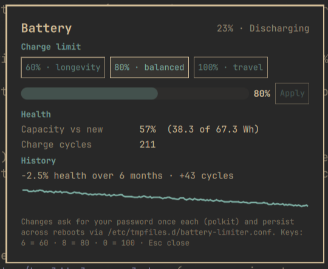

# Battery Limiter for Omarchy

Cap your battery's charge level to extend its lifespan. Charging to 100%
around the clock wears lithium cells; capping at 60–80% dramatically slows
that aging. The Linux kernel exposes the knob — this plugin puts it in
your bar, next to the health stats that show why you'd want it.



## Install

Requires Omarchy 4.x (Quattro). No external dependencies — reads standard
kernel sysfs, and uses `polkit`/`pkexec` (part of every Omarchy install)
for the one privileged action.

```bash
omarchy plugin add https://github.com/alexdont/battery-limiter.git --enable
```

Optional keybinding (add to `~/.config/hypr/bindings.lua`):

```lua
o.bind("SUPER + ALT + B", "Battery limiter", "omarchy-shell batterylimiter toggle")
```

## Use

**Bar icon** — shows 󰁹 plus the active limit when one is set (quiet at
stock 100%). Click to open the card. Prefer just the icon? Turn the
number off with:

```bash
omarchy bar set io.github.alexdont.battery-limiter showLimit false --json
```

(`true` brings it back — takes effect instantly. The setting is declared
in the widget's manifest schema, so it will also appear in the shell's
widget-settings UI as that lands.)

**The card** — current charge and state, the limit presets
(**60% longevity · 80% balanced · 100% travel**, also on keys `6`/`8`/`0`),
a 50–100% slider for custom values (drag, then confirm with **Apply** — a
drag alone never triggers anything), and battery health: usable capacity
vs design capacity and the charge cycle count.

**Notifications** — when the battery finishes charging to your limit, a
single low-priority notification tells you it's safe to unplug (once per
plug-in session; quiet at stock 100%).

**Health history** — once a day the plugin appends one line (date, health
%, cycle count, raw capacity values) to
`~/.local/state/omarchy/io.github.alexdont.battery-limiter/health-log.tsv`
— a plain, greppable TSV you own, ~41 bytes per day (a year is ~15 KB).
The card's **History** section shows the trend it accumulates ("−2.1%
health over 6 months · +180 cycles") with a sparkline drawn over real
time, so gaps read as gaps. It starts as a single "tracking since …" line
and grows meaning the longer the plugin is installed.

## Planned

- `charge_behaviour` support for laptops that expose it instead of a
  threshold.

## How changing the limit works (read before installing)

Writing the kernel's charge threshold requires root. This plugin takes the
most conservative approach available:

- **Reading is unprivileged.** Charge, status, health, cycles, and the
  current limit are plain sysfs reads. No setup, no root.
- **Each change is one explicit `pkexec` prompt.** When you pick a preset
  or apply a slider value, polkit asks for your password, and a one-shot
  root shell does exactly two things:
  1. writes your value to
     `/sys/class/power_supply/<battery>/charge_control_end_threshold`;
  2. writes one line to **`/etc/tmpfiles.d/battery-limiter.conf`** so
     systemd re-applies that value at boot (the sysfs value alone resets
     on reboot). Setting the limit back to **100% deletes that file** —
     stock behavior, zero trace.
- **Nothing else runs as root.** No daemon, no udev rules, no group
  membership changes, no setuid helpers. Decline the polkit prompt and
  nothing happens at all.
- The polkit dialog will say it's authorizing `/usr/bin/sh` — that's this
  plugin's two-line apply script above, passed the validated limit and
  battery path as arguments. You can read the exact command in
  [`Service.qml`](Service.qml) (`setLimit`).

## Hardware support

Vendors vary. ASUS/LG/Samsung/Huawei expose an end threshold (this plugin's
target); some laptops expose nothing. The plugin detects support at start:
without a threshold control it stays read-only and still shows health
stats, which nearly every battery reports (via `energy_full*` or
`charge_full*`). ThinkPad start thresholds and TLP coexistence are out of
scope for v1 — if you run TLP with `STOP_CHARGE_THRESH_BAT0` set, prefer
TLP and leave this plugin read-only.

## Remove

```bash
omarchy plugin remove io.github.alexdont.battery-limiter
sudo rm -f /etc/tmpfiles.d/battery-limiter.conf   # only if you ever set a limit
```

The second command removes the boot persistence (or just set the limit to
100% in the plugin before removing — that deletes the file for you). The
only state the plugin keeps is the daily health log at
`~/.local/state/omarchy/io.github.alexdont.battery-limiter/` — delete that
folder for a clean slate. It touches no other configuration.

## License

MIT
